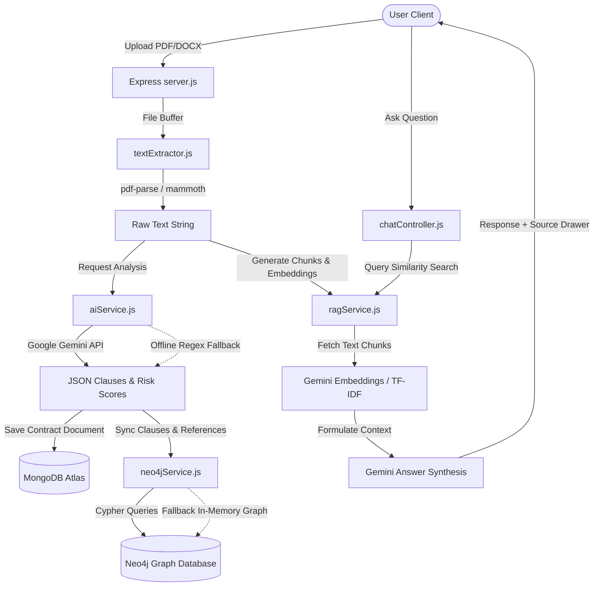

# Legal Document Intelligence System (LegalAI)

A full-stack, educational, and developer-friendly **Legal Document Intelligence System** built using the MERN stack (MongoDB, Express, React, Node.js). 

This system helps users automate the parsing of commercial agreements (PDF and DOCX), extract core clauses (Indemnity, Payment Terms, Limitation of Liability, etc.), analyze risk profiles using AI, compare clauses across contracts side-by-side, search keywords globally, and interact with documents using a **Retrieval-Augmented Generation (RAG)** chatbot.

---

## 🏗️ System Architecture & Data Flow

The diagram below maps how documents are uploaded, processed through text extraction, analyzed by the Gemini Cognitive Pipeline, indexed in Mongoose and Neo4j, and searched using the in-memory RAG vector space:



---

## ✨ Core Features

1. **Document Ingestion Portal:** Upload `.pdf` (via `pdf-parse`) and `.docx` (via `mammoth`) legal agreements. Includes automated sample generation utility for easy validation.
2. **AI Clause Extraction:** Isolates 7 critical clauses: *Payment Terms, Termination, Limitation of Liability, Indemnity, IP Ownership, Governing Law, and Confidentiality*.
3. **Automated Risk Assessment:** Computes an individual risk score (0-100%) and generates detailed justifications for each clause.
4. **Market Standard Comparison:** Ranks terms as *Favourable, Unfavourable, or Unusual* and provides comparative arguments.
5. **Executive Summary Panel:** AI-synthesized commercial purpose, obligations, and top-3 negotiation recommendations.
6. **Side-by-Side Comparator Grid:** Compare selected clauses across multiple contracts to identify inconsistencies.
7. **RAG Contract Chat Console:** Chat with single contracts. Includes a side-drawer showing the exact document context blocks retrieved by vector similarity.
8. **Interactive SVG Relationship Graph:** Renders node-link views mapping contracts to clauses and drawing cross-references.
9. **Admin Panel Status Monitor:** Real-time health checks on MongoDB, Gemini API, and Neo4j with a single-click database reset button.

---

## 🛠️ Technology Stack

*   **Frontend:** React, Vite, Tailwind CSS (v4), Recharts, Lucide React, Axios, React Router (v7).
*   **Backend:** Node.js, Express.js, Multer (multipart uploads).
*   **Database:** MongoDB & Mongoose (primary metadata), Neo4j & Cypher Driver (cross-references, optional).
*   **AI Engine:** Google Gemini Generative AI (Gemini 2.5/Flash) or offline regex-based parsing fallback.
*   **Document Parsers:** Mammoth (DOCX) and PDF-Parse (PDF).
*   **Sample Generator:** PDFKit.

---

## 📡 Backend API Endpoints

### 1. Contract Management
*   `POST /api/contracts/upload`
    *   **Description:** Uploads and analyzes a PDF/DOCX file.
    *   **Payload:** `multipart/form-data` containing `contract` file.
*   `GET /api/contracts`
    *   **Description:** Retrieves all contract summary metadata.
    *   **Query params:** `?search=filename` to filter results.
*   `GET /api/contracts/:id`
    *   **Description:** Retrieves full contract details, extracted clauses, executive summary, and SVG graph representation.
*   `DELETE /api/contracts/:id`
    *   **Description:** Deletes a contract, its metadata, and its graph representation.

### 2. Global Search
*   `GET /api/contracts/search`
    *   **Description:** Scans all contract contents and clause texts for keyword matches.
    *   **Query params:** `?q=searchterm`

### 3. RAG Chat
*   `POST /api/chat/:id`
    *   **Description:** Chats with a contract. Performs semantic similarity chunk matching and synthesizes an AI answer.
    *   **Payload:** `{ "question": "Who owns the IP?" }`

### 4. Admin Utilities
*   `GET /api/admin/status`
    *   **Description:** Evaluates connections of MongoDB, Gemini API, and Neo4j.
*   `POST /api/admin/reset-db`
    *   **Description:** Deletes all database records.

---

## 🚀 Installation & Local Launch

### Step 1: Environment Configurations
Create a `.env` file in the `server/` directory (see `server/.env.example`):
```env
PORT=5000
MONGODB_URI=mongodb://127.0.0.1:27017/legal_doc_intel
GEMINI_API_KEY=YOUR_GOOGLE_GEMINI_KEY
NEO4J_URI=bolt://localhost:7687
NEO4J_USER=neo4j
NEO4J_PASSWORD=yourpassword
```
*(If `GEMINI_API_KEY` is omitted, the application runs in Offline Heuristics mode. If Neo4j parameters are omitted or connection fails, the application switches to in-memory graph construction.)*

### Step 2: Initialize & Run Backend
Navigate to the server directory, install node modules, generate sample files, and boot the server:
```bash
cd server
npm install
npm run generate-docs   # Generates Standard, Risky, and Unusual PDF contracts inside sample-contracts/
npm start               # Starts Express server on http://localhost:5000
```

### Step 3: Initialize & Run Frontend
In a new terminal window, navigate to the client directory, install modules, and run the development bundle:
```bash
cd client
npm install
npm run dev             # Starts Vite development server on http://localhost:5173
```

---

## 💡 Academic & Viva Presentation Tips

1.  **Offline Resiliency Demo:** If your college does not provide stable internet access during your viva, the app will **never crash**. The backend detects the lack of a Gemini key and activates the regex-based fallback engine, still showing simulated risk scores, reasons, and graph linkages.
2.  **RAG Explanation:** Highlight the **RAG Context Source** panel in the Chat Console. Explain that the contract is broken into 500-character chunks, vectorized using Gemini embeddings (or TF-IDF overlap), searched using cosine similarity, and the most relevant chunks are sent as context to Gemini.
3.  **Graph Database Fallback:** Explain that Neo4j is utilized to store relationship nodes (`(:Contract)-[:CONTAINS]->(:Clause)`) and cross-references (`(:Clause)-[:REFERENCES]->(:Clause)`). If Neo4j is offline, the app builds this structure in-memory using an object graph map and renders it as an SVG.
