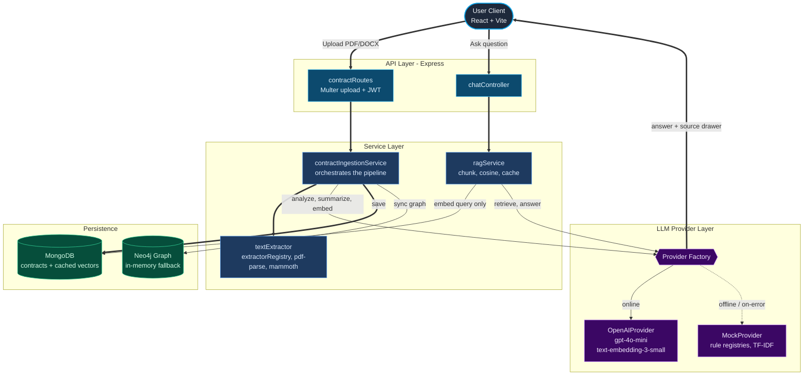

# Legal Document Intelligence System (LegalAI / LexiCore)

A full-stack **Legal Document Intelligence System** built on the MERN stack (MongoDB, Express, React, Node.js).

It automates the parsing of commercial agreements (PDF & DOCX), extracts core clauses (Indemnity, Payment Terms, Limitation of Liability, etc.), scores their risk with AI, compares clauses across contracts, searches keywords globally, and lets you chat with a document via a cached **Retrieval-Augmented Generation (RAG)** pipeline.

The backend is built around clean **Low-Level Design (LLD)** principles: a vendor-agnostic LLM provider abstraction, data-driven rule engines, a thin-controller/service split, centralized configuration and error handling, and a Jest test suite. The app degrades gracefully — it runs fully **offline** (no OpenAI key, no Neo4j) without ever crashing.

---

## 🏗️ System Architecture & Data Flow

Documents are ingested, processed by a swappable LLM provider (OpenAI online / heuristic mock offline), persisted in MongoDB, mirrored into a Neo4j graph (or an in-memory fallback), and queried through a cache-first RAG pipeline.



---

## ✨ Core Features

1. **Document Ingestion Portal** — upload `.pdf` (via `pdf-parse`) and `.docx` (via `mammoth`). A generator utility creates sample contracts for quick validation.
2. **AI Clause Extraction** — isolates 7 critical clauses: *Payment Terms, Termination, Limitation of Liability, Indemnity, IP Ownership, Governing Law, Confidentiality*.
3. **Automated Risk Assessment** — per-clause risk score (0–100) with plain-English justifications.
4. **Market Standard Comparison** — ranks terms as *Favourable, Unfavourable, or Unusual* with comparative reasoning.
5. **Executive Summary Panel** — AI-synthesized purpose, parties, obligations, top risks, and negotiation recommendations.
6. **Side-by-Side Comparator Grid** — compare selected clauses across multiple contracts.
7. **Cached RAG Chat Console** — chat with a contract; a side-drawer shows the exact context chunks retrieved by vector similarity. Embeddings are computed **once at upload** and reused (one query embedding per question).
8. **Interactive Relationship Graph** — node-link view mapping contracts → clauses with cross-references.
9. **JWT Authentication & Roles** — register/login with `user` / `admin` roles; all contract & chat routes are protected; admin-only database reset.
10. **Admin Status Monitor** — live health checks for MongoDB, OpenAI, and Neo4j with a one-click reset.
11. **Light/Dark Theme** — persisted theme toggle, plus clause copy-to-clipboard and JSON report export.

---

## 🛠️ Technology Stack

* **Frontend:** React 19, Vite, Tailwind CSS v4, Recharts, Lucide React, Axios, React Router v7.
* **Backend:** Node.js, Express.js, Multer (multipart uploads), JWT (`jsonwebtoken`), `bcryptjs`.
* **Database:** MongoDB & Mongoose (primary store), Neo4j & Cypher driver (graph cross-references, optional).
* **AI Engine:** OpenAI (`gpt-4o-mini` for analysis/chat, `text-embedding-3-small` for embeddings) with an offline heuristic fallback.
* **Document Parsers:** Mammoth (DOCX), PDF-Parse (PDF). **Sample Generator:** PDFKit.
* **Testing:** Jest + Supertest (backend), ESLint (frontend).

---

## 🧱 Backend Architecture (LLD)

The backend follows a layered design so responsibilities stay isolated and extensible:

```
server/
├── config/
│   ├── aiConfig.js          # Single source of truth: OpenAI client, model ids, tunables
│   └── db.js                # MongoDB connection
├── constants/
│   └── clauseTypes.js       # Shared clause taxonomy + risk/market enums
├── controllers/             # Thin HTTP layer (validate → delegate → respond)
│   ├── contractController.js
│   └── chatController.js
├── services/
│   ├── contractIngestionService.js   # Owns the upload pipeline (SRP)
│   ├── textExtractor.js              # Validate + dispatch to extractor registry
│   ├── ragService.js                 # Chunking, similarity, embedding cache, retrieval
│   ├── riskScoring.js                # Shared risk-averaging helper
│   ├── neo4jService.js               # Graph sync / purge (lazy init, no import side-effects)
│   ├── aiService.js                  # Thin facade over the provider layer
│   ├── llm/                          # LLM Provider abstraction (DIP / OCP / ISP)
│   │   ├── LLMProvider.js            #   interface
│   │   ├── OpenAIProvider.js         #   online implementation
│   │   ├── MockProvider.js           #   offline heuristic implementation
│   │   ├── FallbackProvider.js       #   OpenAI-with-offline-fallback composite
│   │   └── index.js                  #   provider factory (singleton)
│   └── rules/                        # Data-driven rule registries (OCP)
│       ├── clauseRules.js            #   clause extraction registry + engine
│       ├── answerRules.js            #   offline chat intent registry
│       └── extractorRegistry.js      #   file-extension → parser map
├── dto/                     # API serializers (decouple responses from DB schema)
│   ├── contractDTO.js       #   omits rawText / embeddings / __v
│   └── userDTO.js           #   never serializes the password hash
├── errors/AppError.js       # Operational error with HTTP status code
├── middleware/
│   ├── auth.js              # JWT protect + role authorize
│   ├── asyncHandler.js      # Forwards async errors to the central handler
│   └── errorHandler.js      # Single uniform error response
├── models/                  # Mongoose schemas (Contract w/ cached embeddings, User)
├── routes/                  # auth / contracts / chat routers
├── tests/                   # Jest + Supertest suite (DB-free, network-free)
└── server.js                # App bootstrap
```

**Design highlights**
- **Dependency Inversion:** business logic depends on the `LLMProvider` interface, not on the OpenAI SDK. Swapping providers = a new subclass, no consumer edits.
- **Open/Closed:** clause types, chat intents, and file formats are declarative registry entries — the engines never change.
- **Single Responsibility:** controllers only translate HTTP; the ingestion pipeline lives in a service.
- **Resilience:** `FallbackProvider` transparently degrades OpenAI → offline heuristics per operation, so the app never crashes on a missing key or API error.
- **Embedding cache:** chunk vectors are computed once at upload and stored on the contract (under MongoDB's 16 MB doc limit); chat embeds only the query. Old contracts self-heal on first chat.

---

## 📡 Backend API Endpoints

> All `/api/contracts` and `/api/chat` routes require a `Authorization: Bearer <token>` header.

### 1. Authentication
* `POST /api/auth/register` — create a user. Body: `{ username, email, password, role? }`. Returns a JWT.
* `POST /api/auth/login` — authenticate. Body: `{ username, password }`. Returns a JWT.
* `GET /api/auth/me` — current user profile *(protected)*.

### 2. Contract Management *(protected)*
* `POST /api/contracts/upload` — upload & analyze. Payload: `multipart/form-data` with a `contract` file.
* `GET /api/contracts` — list contract summaries. Query: `?search=filename`.
* `GET /api/contracts/:id` — full details: clauses, executive summary, and graph nodes.
* `DELETE /api/contracts/:id` — delete a contract and its graph representation.

### 3. Global Search *(protected)*
* `GET /api/contracts/search?q=term` — scans titles and clause texts for matches.

### 4. RAG Chat *(protected)*
* `POST /api/chat/:id` — chat with a contract. Body: `{ "question": "Who owns the IP?" }`.

### 5. Admin Utilities *(protected)*
* `GET /api/admin/status` — connectivity of MongoDB, OpenAI, and Neo4j.
* `POST /api/admin/reset-db` — wipe all records *(admin role only)*.

---

## 🚀 Installation & Local Launch

### Step 1: Environment Configuration
Create a `.env` file in `server/` (see `server/.env.example`):
```env
PORT=5000
MONGODB_URI=mongodb://127.0.0.1:27017/legal_doc_intel
OPENAI_API_KEY=YOUR_OPENAI_API_KEY
JWT_SECRET=change_this_to_a_long_random_secret
NEO4J_URI=bolt://localhost:7687
NEO4J_USERNAME=neo4j
NEO4J_PASSWORD=yourpassword
```
> If `OPENAI_API_KEY` is omitted, the app runs in **Offline Heuristics** mode (and skips embedding caching, using TF-IDF retrieval). If Neo4j parameters are omitted or unreachable, it falls back to an **in-memory graph**.

### Step 2: Backend
```bash
cd server
npm install
npm run generate-docs   # Generates sample Standard / Risky / Unusual PDFs in sample-contracts/
npm start               # Express on http://localhost:5000
```

### Step 3: Frontend
```bash
cd client
npm install
npm run dev             # Vite dev server on http://localhost:5173
```

### Step 4: First login
Use the **Login** page's one-click demo buttons (auto-registers a `demouser` / `demoadmin`), or register your own account.

---

## ✅ Testing & Quality

```bash
# Backend — Jest + Supertest (no DB or network required; runs in offline/mock mode)
cd server
npm test

# Frontend — ESLint
cd client
npm run lint
npm run build           # production build
```

The backend suite (8 suites / 41 tests) characterizes the AI/RAG/extraction layers and covers the provider abstraction, rule registries, ingestion pipeline, DTO serializers, and the unified error handler. The tests are intentionally **DB-free and network-free** so they run deterministically anywhere.

---

## 💡 Academic & Viva Presentation Tips

1. **Offline Resiliency:** With no `OPENAI_API_KEY`, the `FallbackProvider` activates the offline heuristic engine — clause extraction, risk scores, summaries, and chat all still work. The app **never crashes** without internet.
2. **RAG Explanation:** Contract text is split into ~800-character overlapping chunks, embedded with `text-embedding-3-small` **once at upload** and cached; each question only embeds the query and ranks chunks by cosine similarity. Offline, a TF-IDF keyword vectorizer is used instead. The **Context Source** drawer shows the exact chunks fed to the model.
3. **Clean Architecture:** Walk through the `LLMProvider` abstraction (`services/llm/`) and the rule registries (`services/rules/`) to show Dependency Inversion and Open/Closed in action — and the Jest suite that guards them.
4. **Graph Database Fallback:** Neo4j stores `(:Contract)-[:CONTAINS]->(:Clause)` and `(:Clause)-[:REFERENCES]->(:Clause)`. If offline, the same structure is built in memory and rendered as an interactive SVG.
</content>
